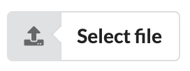

# semantic-ui-react-input-file

a [semantic-ui-react](https://react.semantic-ui.com) compatible input control



[](https://standardjs.com) [](https://github.com/semantic-release/semantic-release) [](https://greenkeeper.io/) [](https://circleci.com/gh/cdaringe/semantic-ui-react-input-file) [](https://www.typescriptlang.org)

## install

`yarn add semantic-ui-react-input-file`

## usage

```tsx
import { InputFile } from 'semantic-ui-react-input-file'

<InputFile
  button={{ ...buttonProps }}
  input={{
    id: 'input-control-id',
    onChange: handleUpload
  }}
/>
```
